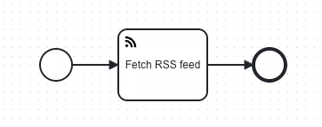

# RSS Feed Connector for Camunda 8

A Camunda 8 Outbound Connector that fetches and parses RSS feed data from a specified URL with optional filtering capabilities.

## Overview

The RSS Feed Connector allows you to integrate RSS/Atom feeds into your Camunda 8 BPMN processes. It fetches feed content, parses it, and returns structured data that can be used in your workflow automation.

### Features

- ✅ Fetch and parse RSS/Atom feeds from any public URL
- ✅ Filter items by date range (fromDate/toDate)
- ✅ Limit the number of returned items (maxItems)
- ✅ Automatic sorting by publication date (most recent first)
- ✅ Graceful handling of incomplete or malformed feed items
- ✅ Comprehensive error handling with specific error codes
- ✅ Support for standard RSS fields: title, link, description, published date, author, categories, GUID

## Build

Package the Connector by running:

```bash
mvn clean package
```

This creates:
- A thin JAR without dependencies
- A fat JAR (uber JAR) with all dependencies, suitable for deployment

The element template is automatically generated during the build process and placed in `element-templates/rss-feed-connector.json`.

## API

### Input Parameters

| Name     | Type    | Required | Description                                                                 | Example                                  |
|----------|---------|----------|-----------------------------------------------------------------------------|------------------------------------------|
| feedUrl  | String  | Yes      | The URL of the RSS feed to fetch                                            | `https://feeds.bbci.co.uk/news/rss.xml`  |
| maxItems | Integer | No       | Maximum number of items to return (default: 10, max: 500)                   | `10`                                     |
| fromDate | String  | No       | Filter items published on or after this date (ISO8601 format)               | `2025-01-01T00:00:00Z`                   |
| toDate   | String  | No       | Filter items published on or before this date (ISO8601 format)              | `2025-12-31T23:59:59Z`                   |

### Output Structure

```json
{
  "items": [
    {
      "title": "Breaking News: Example Title",
      "link": "https://example.com/article",
      "description": "Article summary or description",
      "publishedDate": "2025-10-26T10:30:00Z",
      "author": "John Doe",
      "categories": ["Technology", "News"],
      "guid": "https://example.com/article"
    }
  ],
  "totalItems": 150,
  "filteredItems": 10
}
```

**Field Descriptions:**
- `items`: Array of RSS feed items after filtering and limiting
- `totalItems`: Total number of items in the original feed
- `filteredItems`: Number of items after applying filters and limits

### Error Codes

| Code                 | Description                                                    | Resolution                                |
|----------------------|----------------------------------------------------------------|-------------------------------------------|
| `INVALID_URL`        | The provided URL is malformed or invalid                       | Check the URL format (must be HTTP/HTTPS) |
| `FETCH_ERROR`        | Failed to fetch the feed (network or server error)             | Verify the URL is accessible              |
| `PARSE_ERROR`        | Failed to parse the feed (invalid RSS/Atom XML)                | Ensure the feed is valid RSS/Atom format  |
| `INVALID_DATE_FORMAT`| The fromDate or toDate is not in ISO8601 format                | Use format: `2025-01-01T00:00:00Z`        |

## Usage Example

### BPMN Configuration

1. Add a Service Task to your BPMN diagram
2. Apply the "RSS Feed Connector" element template
3. Configure the input parameters:



```json
{
  "feedUrl": "https://feeds.bbci.co.uk/news/rss.xml",
  "maxItems": 5,
  "fromDate": "2025-10-01T00:00:00Z"
}
```

4. Map the output to a process variable:
   - Result variable: `feedResult`

5. Access the results in subsequent tasks:
   - `feedResult.items[0].title` - First item's title
   - `feedResult.filteredItems` - Number of items returned

### Sample RSS Feeds for Testing

Here are some publicly available RSS feeds you can use for testing:

| Source          | URL                                                          |
|-----------------|--------------------------------------------------------------|
| BBC News        | `https://feeds.bbci.co.uk/news/rss.xml`                      |
| The Guardian    | `https://www.theguardian.com/world/rss`                      |
| TechCrunch      | `https://techcrunch.com/feed/`                               |
| Hacker News     | `https://news.ycombinator.com/rss`                           |
| NASA Breaking   | `https://www.nasa.gov/rss/dyn/breaking_news.rss`             |

## Testing the Connector

### Run Unit Tests

```bash
mvn clean verify
```

The test suite includes:
- Valid RSS feed parsing
- Empty feed handling
- Invalid URL and malformed XML error handling
- Date filtering (fromDate, toDate, date range)
- MaxItems limiting
- Sorting verification
- Missing field handling

### Hosting Custom Connectors

Based on the [Camunda documentation](https://docs.camunda.io/docs/components/connectors/custom-built-connectors/host-custom-connectors/), there are several ways to host your custom RSS Feed Connector. We've tested both local Docker and SaaS approaches successfully.

#### Prerequisites

1. **Build the connector**: First, build the fat JAR with all dependencies:
   ```bash
   mvn clean package
   ```
   This creates `target/connector-rssfeed-0.1.0-SNAPSHOT.jar` (the fat JAR with dependencies).

2. **Docker**: Ensure Docker is installed and running
3. **Camunda Cluster**: Either a local Docker cluster or SaaS cluster

### Approach 1: Local Docker Cluster (without Keycloak)

This approach uses Docker with plaintext security for local development.

#### Setup Local Camunda Cluster

1. Clone the [Camunda 8 Distributions repository](https://github.com/camunda/camunda-distributions):
   ```bash
   git clone https://github.com/camunda/camunda-distributions.git
   cd camunda-distributions/docker-compose/versions/camunda-8.8
   ```

2. Start Camunda 8 with Docker Compose:
   ```bash
   docker compose up -d
   ```

3. Verify the cluster is running:
   ```bash
   docker ps | grep camunda
   ```
   You should see containers for `orchestration` and `connectors`.

#### Deploy Your Custom Connector

Run your RSS Feed Connector using the connectors-bundle Docker image:

```bash
docker run --rm --name=CustomConnectorInSMCore \
    -v $PWD/target/connector-rssfeed-0.1.0-SNAPSHOT.jar:/opt/app/connector.jar \
    --network=host \
    -e CAMUNDA_CLIENT_BROKER_GATEWAY-ADDRESS=localhost:26500 \
    -e CAMUNDA_CLIENT_SECURITY_PLAINTEXT=true \
    -e CAMUNDA_OPERATE_CLIENT_URL=http://localhost:8088 \
    -e CAMUNDA_OPERATE_CLIENT_USERNAME=demo \
    -e CAMUNDA_OPERATE_CLIENT_PASSWORD=demo \
    camunda/connectors-bundle:8.8.1
```

**Key points:**
- `--network=host`: Allows the connector to connect to localhost services
- `CAMUNDA_CLIENT_SECURITY_PLAINTEXT=true`: Uses plaintext security for local development
- `camunda/connectors-bundle:8.8.1`: Uses the correct version tag

#### Verify Success

In the logs, you should see:
```
Starting job worker: JobWorkerValue{type='io.camunda:rssfeed:1', name='RssFeedConnector', ...}
```

This confirms your RSS Feed Connector is loaded and ready to process jobs.

#### Access Camunda Components

- **Operate**: [http://localhost:8088/operate](http://localhost:8088/operate) - Monitor process instances
- **Tasklist**: [http://localhost:8088/tasklist](http://localhost:8088/tasklist) - Complete user tasks
- Login with username: `demo`, password: `demo`

### Approach 2: Camunda SaaS Cluster

This approach connects your custom connector to a Camunda SaaS cluster.

#### Prerequisites

1. **SaaS Cluster**: Create a cluster at [Camunda SaaS Console](https://console.camunda.io)
2. **API Credentials**: Create a client with `zeebe` scope and copy the credentials
3. **Update Configuration**: Update `src/test/resources/application.properties` with your SaaS credentials

#### Deploy Your Custom Connector

Run your RSS Feed Connector connected to SaaS:

```bash
docker run --rm --name=CustomConnectorInSaaS \
    -v $PWD/target/connector-rssfeed-0.1.0-SNAPSHOT.jar:/opt/app/connector.jar \
    -e CAMUNDA_CLIENT_SECURITY_PLAINTEXT=false \
    -e CAMUNDA_CLIENT_AUTH_CLIENT_ID='<YOUR_CLIENT_ID>' \
    -e CAMUNDA_CLIENT_AUTH_CLIENT_SECRET='<YOUR_CLIENT_SECRET>' \
    -e CAMUNDA_CLIENT_CLOUD_CLUSTER_ID='<YOUR_CLUSTER_ID>' \
    -e CAMUNDA_CLIENT_CLOUD_REGION='<YOUR_CLUSTER_REGION>' \
    -e CAMUNDA_OPERATE_CLIENT_URL='https://<region>.operate.camunda.io/<cluster-id>' \
    camunda/connectors-bundle:8.8.1
```

**Replace the following with your actual SaaS credentials:**
- `<YOUR_CLUSTER_ID>`: Your cluster ID from the SaaS console
- `<YOUR_CLIENT_ID>`: Your client ID
- `<YOUR_CLIENT_SECRET>`: Your client secret
- `<YOUR_CLUSTER_REGION>`: Your cluster region (e.g., `bru-2`, `us-1`)

#### Verify Success

In the logs, you should see:
```
Starting job worker: JobWorkerValue{type='io.camunda:rssfeed:1', name='RssFeedConnector', ...}
```

This confirms your RSS Feed Connector is loaded and ready to process jobs. The connector will successfully authenticate with the SaaS cluster and start polling for jobs.

### Approach 3: Local Development with Spring Boot

For development and testing, you can also run the connector directly with Spring Boot:

#### Local Development

1. **Start Local Camunda Cluster** (as described in Approach 1)

2. **Run the connector**:
   ```bash
   ./run-connector.sh local
   ```
   
   Or manually:
   ```bash
   mvn exec:java -Dspring.config.additional-location=src/test/resources/application-local.properties
   ```

#### SaaS Development

1. **Update SaaS credentials** in `src/test/resources/application.properties`

2. **Run the connector**:
   ```bash
   ./run-connector.sh saas
   ```
   
   Or manually:
   ```bash
   mvn exec:java
   ```

### Using the Connector in BPMN Processes

1. **Install Element Template**:
   - Copy `element-templates/rss-feed-connector.json` to your Desktop Modeler's element templates directory
   - Or upload it to Web Modeler

2. **Create BPMN Process**:
   - Add a Service Task to your BPMN diagram
   - Apply the "RSS Feed Connector" element template
   - Configure the input parameters (feedUrl, maxItems, fromDate, toDate)

3. **Deploy and Run**:
   - Deploy your process to the cluster
   - Start a process instance
   - Monitor execution in Operate

### Cleanup

#### Stop Local Cluster
```bash
cd camunda-distributions/docker-compose/versions/camunda-8.8
docker compose down -v
```

#### Stop Connector Containers
```bash
docker stop CustomConnectorInSMCore  # For local Docker approach
docker stop CustomConnectorInSaaS    # For SaaS approach
```

### Troubleshooting

#### Common Issues

1. **Authentication Errors**: Ensure your SaaS credentials are correct and use the proper environment variable names:
   - `CAMUNDA_CLIENT_AUTH_CLIENT_ID` (not `CAMUNDA_CLIENT_CLOUD_CLIENT-ID`)
   - `CAMUNDA_CLIENT_AUTH_CLIENT_SECRET` (not `CAMUNDA_CLIENT_CLOUD_CLIENT-SECRET`)
   - `CAMUNDA_CLIENT_CLOUD_CLUSTER_ID` (not `CAMUNDA_CLIENT_CLOUD_CLUSTER-ID`)
2. **Network Issues**: Use `--network=host` for local Docker approach
3. **Version Mismatch**: Ensure you're using `camunda/connectors-bundle:8.8.1` or compatible version
4. **JAR Not Found**: Ensure the connector JAR is built and the path is correct

#### Logs

Check connector logs for detailed information:
```bash
docker logs CustomConnectorInSMCore  # For local Docker
docker logs CustomConnectorInSaaS    # For SaaS
```

Look for the line confirming your connector is loaded:
```
Starting job worker: JobWorkerValue{type='io.camunda:rssfeed:1', name='RssFeedConnector', ...}
```

## Quick Start

The connector includes a convenient runner script for different environments:

```bash
# Run connector connected to Camunda SaaS
./run-connector.sh saas

# Run connector connected to local Camunda Platform
./run-connector.sh local

# Run unit tests
./run-connector.sh test
```

## Element Template

The element template is automatically generated from the connector input class using the [Element Template Generator](https://github.com/camunda/connectors/tree/main/element-template-generator/core).

To regenerate the template:

```bash
mvn clean package
```

The generated template: `element-templates/rss-feed-connector.json`

## Technical Details

### Dependencies

- **Rome Tools (2.1.0)**: RSS/Atom feed parsing library
- **Camunda Connector SDK (8.8.1)**: Connector framework
- **Jakarta Validation**: Input parameter validation
- **SLF4J**: Logging

### Architecture

The connector follows the Camunda Connector SDK pattern:

```
io.camunda.connector.rssfeed/
├── RssFeedConnectorFunction.java    # Main connector logic
└── dto/
    ├── RssFeedRequest.java           # Input parameters with validation
    ├── RssFeedResult.java            # Output structure
    └── RssFeedItem.java              # Individual feed item
```

### Processing Pipeline

1. **Validation**: URL and date format validation
2. **Fetch**: HTTP request to feed URL
3. **Parse**: XML parsing using Rome Tools
4. **Filter**: Apply date range filters
5. **Sort**: Order by publishedDate descending
6. **Limit**: Apply maxItems limit
7. **Return**: Structured result with metadata

## Future Extensions

Potential enhancements for future versions:

- **Authentication Support**: Basic Auth and custom headers for protected feeds
- **Atom Feed Optimization**: Enhanced Atom-specific field mapping
- **Pagination**: Support for feeds with pagination
- **Caching**: Optional feed caching to reduce network requests
- **Content Filtering**: Keyword-based filtering of feed content
- **Multiple Feeds**: Fetch and merge multiple feeds in one connector call
- **Webhooks**: Subscribe to feed updates instead of polling

## Contributing

Contributions are welcome! Please feel free to submit issues or pull requests.

## License

This project is licensed under the Apache License 2.0 - see the [LICENSE](LICENSE) file for details.

## Security

This project implements secure credential management to protect sensitive data. See [SECURITY.md](SECURITY.md) for detailed security practices and setup instructions.

**Quick Setup:**
```bash
./setup-credentials.sh
# Edit src/test/resources/application-local.properties with your credentials
./run-connector.sh saas
```

## Support

For questions or issues:
- Review the [Camunda Connector SDK documentation](https://docs.camunda.io/docs/components/connectors/custom-built-connectors/connector-sdk/)
- Check the [Element Templates documentation](https://docs.camunda.io/docs/components/modeler/element-templates/defining-templates/)
- See [SECURITY.md](SECURITY.md) for credential management
- Open an issue in this repository
